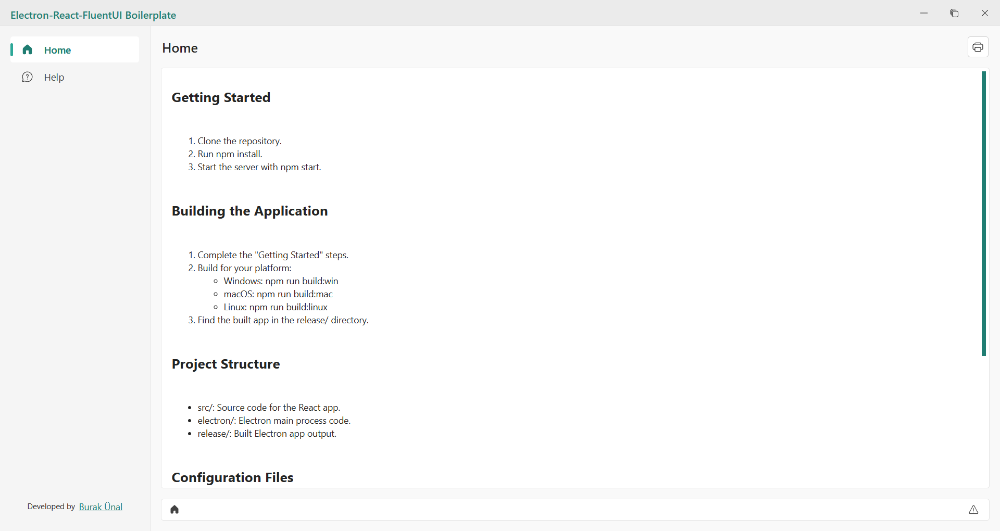

# Electron React FluentUI Boilerplate

A modern boilerplate for building Electron applications with React and Fluent UI, featuring user settings and theme management.

## Preview



## Getting Started 🛠️

1. Clone the repository.
2. Install dependencies: `bun install`
3. Start the development server: `bun start`

## Building the Application

1. Complete the "Getting Started" steps.
2. Build for your platform:
   - Windows: `bun run build`
   - Multi-platform support via `electron-builder` configuration
3. Find the built application in the `release/` directory.

## Project Structure

```
├── renderer/              # React application source code
│   ├── components/        # UI components
│   │   ├── breadcrumb/    # Breadcrumb navigation
│   │   ├── dialog/        # Modal dialog components
│   │   ├── error/         # Error boundary components
│   │   ├── footer/        # Footer component
│   │   ├── navbar/        # Top navigation bar
│   │   ├── report/        # Report components
│   │   └── sidebar/       # Sidebar component
│   ├── context/           # React Context providers
│   │   ├── grid/          # Grid state management
│   │   ├── location/      # Location state
│   │   └── tabs/          # Tab management
│   ├── hooks/             # Custom React hooks
│   ├── layout/            # Layout components
│   ├── pages/             # Page components
│   │   ├── help/          # Help page
│   │   └── home/          # Home page
│   ├── routes/            # React Router configuration
│   └── types/             # React-specific TypeScript types
├── electron/              # Electron main process code
│   ├── main.ts            # Main Electron process
│   ├── preload.ts         # Preload script
│   └── types/             # Electron-specific types
├── types/                 # Centralized TypeScript definitions
│   ├── vite-env.d.ts      # Vite client types
│   ├── electron-env.d.ts  # Electron & Node.js types
│   └── index.d.ts         # Main type entry point
├── dist-electron/         # Compiled Electron files
└── release/               # Packaged application output
```

## Available Bun Scripts

### Development
- `bun start` / `bun dev`: Start development server
- `bun run preview`: Preview the built application

### Building
- `bun run build`: Complete build pipeline (renderer → electron → package)
- `bun run build:renderer`: Build React app only (`dist/`)
- `bun run build:electron`: Compile Electron TypeScript (`dist-electron/`)
- `bun run package`: Package with electron-builder (`release/`)

### Code Quality
- `bun run lint`: Code analysis with Biome (renderer + electron)
- `bun run format`: Code formatting with Biome
- `bun run check`: Comprehensive check with Biome

### Type Checking
- `bun run type-check`: TypeScript check for renderer
- `bun run type-check:electron`: TypeScript check for Electron

### Utilities
- `bun run clean`: Remove build artifacts (`dist`, `dist-electron`, `release`)

## Configuration Files

- `package.json`: Project metadata and dependencies
- `electron-builder.json5`: Build configuration for platforms
- `vite.config.ts`: Vite configuration (React + Electron)
- `biome.json`: Biome linter and formatter configuration
- `tsconfig.json`: TypeScript configuration (renderer)
- `tsconfig-electron.json`: TypeScript configuration (electron)
- `tsconfig.node.json`: Node.js TypeScript configuration

## Technology Stack

### Core Technologies
- **Electron**: Desktop application framework
- **React 19**: UI library (latest version)
- **TypeScript**: Type-safe JavaScript
- **Vite**: Fast build tool and dev server
- **FluentUI**: Microsoft's modern UI component library

### Development Tools
- **Biome**: Fast linter and formatter (ESLint + Prettier alternative)
- **Electron Builder**: Application packaging and distribution
- **Sass**: CSS preprocessor
- **React Router DOM**: Client-side routing

### Key Dependencies
- `@fluentui/react-components`: FluentUI components
- `@fluentui/react-icons`: FluentUI icons  
- `react-router-dom`: Routing management

## Features

- **Modern UI**: Windows 11-style interface with FluentUI components
- **Error Handling**: Comprehensive error boundaries for stability
- **TypeScript**: Full type safety
- **Hot Reload**: Instant reloading during development
- **Context API**: Global state management (Grid, Location, Tabs)
- **Custom Hooks**: Reusable React hooks
- **Responsive Layout**: Adaptive sidebar and navbar
- **Routing**: Page navigation with React Router
- **Code Quality**: Automatic code formatting and linting with Biome

## Development Notes

- FluentUI components are compatible with Microsoft's design system
- Electron's `nativeTheme` API can be utilized for system theme detection
- Very fast development experience thanks to Vite
- Biome offers a much faster alternative to ESLint and Prettier
- Error boundaries provide robust error handling in React components

## Architecture Decisions

### Styling Strategy
- **Single SCSS file**: All styles in `renderer/styles.scss` for simplicity
- **CSS Variables**: Theme-based color variables for light/dark modes
- **FluentUI Integration**: Leverages FluentUI's design tokens

### Context Hierarchy
- **LocationProvider** (outermost): Router location context
- **GridProvider** (middle): Grid state management  
- **TabProvider** (innermost): Tab state, changes most frequently

### Type Safety
- **Centralized types**: Global types in `/types` directory
- **Module types**: Component-specific types in respective `/types` folders
- **Environment types**: Electron and Vite environment extensions

## Environment Variables

The following environment variables can be configured in the `.env` file:

- `ENABLE_DEVTOOLS`: Enable development tools (`true`/`false`) (default: true)
- `LOG_LEVEL`: Log level (`error`, `warn`, `info`) (default: error)  
- `NODE_ENV`: Environment (`development`, `production`)

## License

This project is open source and available under the [MIT License](LICENSE).

## Developer

Created by [Burak Ünal](https://github.com/burakunal28).

---

**Note**: This boilerplate uses the latest technologies for developing modern Electron applications. Optimized with the latest versions like React 19, Vite 7, and Electron 37.
